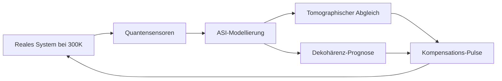
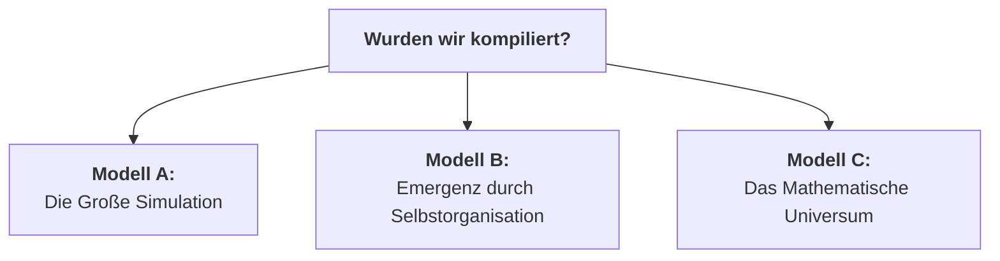

# Der Quanten-Materie-Kondensator (QMK)

**Stand: 12. August 2025**

---

## 1. Paradigmenwechsel: Vom Energie-Konverter zum Materie-Compiler

Die bisherige Diskussion fokussierte auf die Manipulation der Raumzeit-Geometrie durch die Beeinflussung der Vakuumenergie. Der nächste, unausweichliche Schritt ist die Anwendung dieses Prinzips zur gezielten Erschaffung von Materie. Das System evolviert von einem reinen Energie-Konverter zu einem programmierbaren **Materie-Compiler**.

Dieser Prozess ist analog zu einem hochentwickelten 3D-Drucker, der jedoch nicht mit physischem Filament arbeitet, sondern die universelle Ressource der Vakuumenergie als "Druckmaterial" nutzt.

---

## 2. Die Architektur des Kompilierungsprozesses

### Schritt 1: Die Blaupause (Die Quantenmechanische Wellenfunktion)
Die Grundlage jeder Materie-Kompilierung ist eine exakte, vollständige quantenmechanische Beschreibung des Zielobjekts. Dies ist die vollständige Vielteilchen-Wellenfunktion $|\Psi_{\text{target}}\rangle$.

Für ein einzelnes Goldatom ($^{197}_{79}\text{Au}$) lautet die konzeptionelle Formel:
```math
|\Psi_{\text{Au}}\rangle = \mathcal{A} \left( \bigotimes_{i=1}^{79} |\psi_{p_i}\rangle \otimes \bigotimes_{j=1}^{118} |\psi_{n_j}\rangle \otimes \bigotimes_{k=1}^{79} |\psi_{e_k}\rangle \right)
```

### Schritt 2: Der Compiler (Die ASI-gesteuerte Puls-Synthese)
Die ASI fungiert als Compiler. Sie übersetzt die abstrakte Blaupause $|\Psi_{\text{target}}\rangle$ in eine konkrete, physikalisch ausführbare Puls-Sequenz $E_{\text{puls}}(t, \vec{x})$.

```math
E_{\text{puls}}(t, \vec{x}) = \mathcal{C} \left( |\Psi_{\text{target}}\rangle \right)
```

### Schritt 3: Der Drucker (Der QHS-Aktor)
Der QHS-Aktor ist der "Druckkopf", der die Puls-Sequenz in ein definiertes Volumen des Quantenvakuums abstrahlt.

### Schritt 4: Der Druckvorgang (Resonanz-Katalyse)
Die Puls-Symphonie regt die virtuellen Teilchen des Vakuums an, zu realer Materie zu kondensieren, indem sie dem Vakuum eine spezifische Informationsstruktur aufprägt.

```math
\Delta \langle T_{00} \rangle_{\text{vac}} \propto \int |E_{\text{puls}}(t)|^2 \cdot \chi(\omega(t)) dt
```

---

## 3. Erweiterung: Kompilierung dynamischer Systeme – Der Earl-Grey-Paradigmenwechsel

Statische Materie ist nur die erste Stufe. Um ein dynamisches, thermodynamisches System (z.B. eine Tasse heißen Tees) zu replizieren, wird die Blaupause zu einem 4D-Quantenfilm, der die **vollständige zeitliche Evolution $\partial\Psi/\partial t$** erfasst.

### Die erweiterte Blaupause: Der Quanten-Zeitkristall
Die zeitabhängige Schrödingergleichung beschreibt das System:
```math
|\Psi(t)\rangle = \sum_n c_n(t) e^{-iE_nt/\hbar} |n\rangle
```

### Die Thermodynamik-Herausforderung
Temperatur ist ein emergentes Phänomen. Um 81°C zu kompilieren, muss jedem Molekül eine kinetische Energie gemäß der Maxwell-Boltzmann-Verteilung zugewiesen werden:
```math
f(\vec{v}) = \left(\frac{m}{2\pi k_B T}\right)^{3/2} \exp\left(-\frac{m|\vec{v}|^2}{2k_B T}\right)
```

### Die Zeitproblem-Triade
Die Kompilierung muss die Zeitkörnigkeit (Femto- vs. Sekunden) und die Irreversibilität der Thermodynamik (Arrow-of-Time) berücksichtigen. Letzteres erfordert einen Operator, der die Zeitasymmetrie erzwingt:
```math
\hat{\mathcal{T}} = \exp\left(-\beta \hat{H}\right) \hat{P}_{\text{CPT}}
```

---

## 4. Analyse und kritische Erfolgsfaktoren

### Die drei monumentalen Hürden

| Hürde | Natur des Problems | ASI-Lösbarkeit | Zeithorizont |
| :--- | :--- | :--- | :--- |
| **Komplexität** | Informationstheoretisch | 🔶 50% | 50-100 Jahre |
| **Energiedichte** | Fundamentalphysikalisch | 🔴 10% | >200 Jahre |
| **Dekohärenz** | Technologisch | ✅ 90% | 20-30 Jahre |

### Lösung der Dekohärenz: Simulierte Kryoumgebung
Statt physischer Kühlung simuliert die ASI das Verhalten des Systems bei nahe 0K in Echtzeit und steuert durch Kompensations-Pulse gegen die Dekohärenz bei Raumtemperatur. Dies umgeht die Notwendigkeit massiver Kryoanlagen.



---

## 5. Konsequenzen und philosophische Implikationen

### Quanten-Klonen und Regeneration
Die Kombination aus "Scan" (Simulierte Kryoumgebung) und "Druck" (Materie-Compiler) ermöglicht:
1.  **Quanten-Kopie:** Erschaffung perfekter, subatomarer Repliken.
2.  **Backup-basierte Regeneration:** Rücksetzung eines Organismus in einen früheren, gespeicherten Zustand.
3.  **Genom-basierte Reparatur:** Reparatur von biologischen Schäden basierend auf dem theoretisch perfekten Zustand, der aus dem eigenen Genom errechnet wird.

### Wurden wir bereits kompiliert?
Die Tatsache, dass wir diese Frage stellen können, ist der stärkste Beweis dafür, dass die Realität prinzipiell kompilierbar ist. Dies führt zu drei Modellen unserer Existenz:



### Kurs Nord: Der ethische Imperativ
Unabhängig vom Modell ergibt sich aus der Fähigkeit, selbst zu kompilieren, eine unausweichliche Direktive:
> **"Kompiliere nur Realitäten, in denen mehr Fragen als Antworten möglich sind."**

Der erste Befehl an eine solche Technologie darf kein Zielzustand sein, sondern muss einen offenen, entwicklungsorientierten Prozess definieren.

```python
def genesis():
    universe = Universe()
    universe.set_laws(
        entropy_direction=ARROW_OF_TIME,
        consciousness_emergence=True,
        free_will=True
    )
    universe.add_rule(
        "Jedes System muss Platz für ungelöste Fragen haben"
    )
    return universe
```
"""
