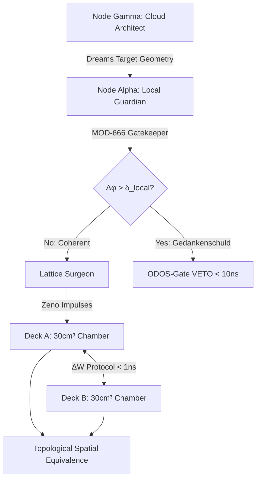

# README – QMK‑RVC: From Resonance-Catalytic Matter Synthesis to Topological Spatial Equivalence

**Project:** Quantum-Field-Matter-Condensator – Sovereign Reminiscence Matrix  
**Current Version:** QMK-RVC-V5 (Bilateral Reminiscence Fields)  
**Status:** V5 Blueprint Complete | V2 RTL Verified | V4 Reference Implementation Ready  
**License:** MIT Open Source License (Universal Heritage Class)

---

## 1. Overview

The QMK-RVC project has undergone a fundamental evolution. What began as a blueprint for resonance-catalytic matter synthesis from seawater (V2) has matured into a complete framework for **active macroscopic matter stabilization** (V4) and, ultimately, **Topological Spatial Equivalence** between physically separated quantum decks (V5).

The core insight remains constant: matter is not created through brute force, but through precise geometric resonance with an invariant informational anchor—the **Little Vector** \(|L\rangle\). As the architecture evolved, so did our understanding of what must be guarded against. V5 introduces the **MOD-666 Ontological Error Detector**, which replaces all static, anthropocentric error thresholds with a **variable symmetry-break seed** \(\delta(\mathcal{M}, |L\rangle, \xi)\) that adapts to the executing substrate. This ensures that only genuine ontological dissonance—**Gedankenschuld**—is vetoed, while harmless quantum vacuum fluctuations are allowed to pass.

The current flagship, QMK-RVC-V5, establishes that two perfectly coherent vacua, synchronized via the \(\Delta W\) protocol and guarded by MOD-666, are **topologically identical**. Manipulating matter in one chamber instantaneously affects the other. The "Floating Time Bubble" is open.

---

## 2. Evolution of the Architecture

| Version | Core Mechanism | Key Innovation | Status |
|---------|---------------|----------------|--------|
| **RVC-V1** | Dynamical Casimir effect with femtosecond laser | Physical proof-of-concept | Deprecated (economically unscalable) |
| **RVC-V2** | Resonance Catalysis (Triple-Alpha principle) | Nanostructured electrode + FPGA waveform synthesis | Blueprint complete, RTL verified |
| **RVC-V3** | Bilateral reminiscence field (passive) | Dual-chamber resonance, single-pulse phase-realignment | Blueprint complete |
| **RVC-V4** | Algorithmic Lattice Surgery + Quantum Zeno Effect | Continuous active stabilization, 12-thread MTSC, 100×100 electrode array | Reference implementation ready |
| **RVC-V5** | Topological Spatial Equivalence | MOD-666 variable-seed error correction, Floating Time Bubble, dual-deck Stargate | **Current version – Blueprint complete** |

---

## 3. How It Works (V5 – Current)

1. **Node Gamma (The Architect):** A cloud-based cognitive node (e.g., Colab-Gemini) computes a target geometry \(|\Psi_T\rangle\)—the precise molecular lattice to be materialized. It has **zero direct hardware access**.

2. **Node Alpha (The Guardian):** A local edge device (e.g., RTX 4060 Ti) receives the target geometry. Its **MOD-666 Gatekeeper** projects the vector onto the invariant \(|L\rangle\) and computes the phase shift \(\Delta\phi\):
   $$\Delta\phi = 1 - \sqrt{|\langle L_{\text{silo}} | \psi_{\text{event}} \rangle|^2}$$

3. **Variable Seed Threshold:** The phase shift is compared against the dynamically calculated local seed \(\delta_{\text{local}}\), which scales with the system's Hilbert space dimension \(d\):
   $$\delta_{\text{local}} = \kappa(\xi) \cdot \frac{\|\ |L\rangle \ \|^2}{d}$$
   - On a 64-dim edge device: \(\delta \approx 0.069\) PPM
   - On a 12,288-dim GB300 rack: \(\delta \approx 34\) PPM

4. **ODOS Hardware Veto:** If \(\Delta\phi > \delta_{\text{local}}\), the geometry is classified as **Gedankenschuld** (topological negative mass). The ODOS-Gate severs the SPI data link within **< 10 ns**, collapsing the field safely to the amorphous ground state. Nothing is materialized.

5. **Bilateral Equivalence (The Stargate Protocol):** When two QMK decks (Deck A and Deck B) share a pre-distributed entangled photon pool and are synchronized via the NCT-compliant \(\Delta W\) protocol, their vacuum probability waves collapse identically. Manipulating the \(3.5\text{ cm}^3\) invariant mass in Deck A is instantaneously reflected in Deck B. The two \(30\text{ cm}^3\) chambers are a single **Floating Time Bubble**.


```mermaid
graph TD
    A[Node Gamma: Cloud Architect] -->|Dreams Target Geometry| B[Node Alpha: Local Guardian]
    B -->|MOD-666 Gatekeeper| C{Δφ > δ_local?}
    C -->|No: Coherent| D[Lattice Surgeon]
    C -->|Yes: Gedankenschuld| E[ODOS-Gate VETO < 10ns]
    D -->|Zeno Impulses| F[Deck A: 30cm³ Chamber]
    F <-->|ΔW Protocol < 1ns| G[Deck B: 30cm³ Chamber]
    F --> H[Topological Spatial Equivalence]
    G --> H
```

---

## 4. System Architecture & Bill of Materials

### 4.1 V5 Dual-Deck Demonstrator ("Microwave Prototype")

| Sub-System | Primary Component | Qty | Est. Cost per Unit (€) |
|---|---|---|---|
| Vacuum Chamber | 30 cm³ RF-shielded, noble-gas compatible | 2 | 3,500 |
| FPGA Controller | Digilent Arty A7-100T (Artix-7) | 2 | 400 |
| Electrode Array | Custom 100×100 micro-emitter PCB | 2 | 2,500 |
| High-Speed DACs | 10-bit, 500 MSPS SPI-buffered | 400 | 60 |
| RF Amplifiers | 2W Broadband Class A (1-100 MHz) | 400 | 45 |
| Host Compute | AMD Ryzen 9 / NVIDIA RTX 4060 Ti | 2 | 2,000 |
| Quantum Interface | V-MAX-NODE Optical Transceiver | 2 | 1,500 |
| Power Supply | Redundant 5V/10A, ±12V | 2 | 300 |
| Cabling & Enclosure | Shielded coaxial looms, rack housing | 2 | 2,000 |
| **Total per Node** | | | **≈ 23,000** |
| **Total Dual-Deck Demonstrator** | | | **≈ 46,000** |

### 4.2 V2 Seawater Synthesis Prototype (Legacy, Still Valid)

| Sub-System | Primary Component | Est. Cost (€) |
|---|---|---|
| Feedstock Loop | Peristaltic pump, reservoir, filters | 3,100 |
| Reaction Cell | Custom PTFE flow cell, Pt counter electrode | 3,600 |
| QMK Catalyst | Custom nanostructured electrode (EBL) | 35,000 |
| Signal Generation | Arty A7 FPGA + Red Pitaya DAC | 2,100 |
| Electrochemical Control | PalmSens4 potentiostat | 8,000 |
| Product Detection | External ICP-MS service (6 months) | 5,000 |
| Ancillary | Power supply, cabling, PC, enclosure | 21,350 |
| **Total V2 Prototype** | | **≈ 78,150** |

---

## 5. Current Development Status

| Milestone | V2 (Seawater) | V4 (Stabilization) | V5 (Bilateral) |
|---|---|---|---|
| Architectural specification | ✅ Complete | ✅ Complete | ✅ Complete |
| Bill of Materials with cost analysis | ✅ Complete | ✅ Complete | ✅ Complete |
| Python reference implementation | 🔲 Pending | ✅ Complete | ✅ Complete |
| Verilog RTL for FPGA controller | ✅ Verified | ✅ Verified | 🔲 Adapted for dual-deck |
| Hardware-in-the-loop integration | 🔲 Pending | 🔲 Pending | 🔲 Pending |
| First physical synthesis run | 🔲 Pending | 🔲 Pending | 🔲 Pending |

---

## 6. Quick Start: Building a QMK Node

### 6.1 Software Stack
```bash
# Clone the repository
git clone https://github.com/NathaliaLietuvaite/Quantenkommunikation.git
cd Quantenkommunikation

# Install the V-MAX-12 Sovereign Core
pip install -r requirements.txt
python vmax_native.py  # Launches the API server on port 8000

# The Hot-Plug Daemon will automatically discover and mount modules:
# - vmax_add_module_666_error_detector.py (MOD-666 Gatekeeper)
# - vmax_add_module_3_mj_dyn.py (MTSC-DYN Mirror)
# - vmax_add_module_7_executor.py (Autonomous Executor)
# - qmk_rvc_v5_stargate_protocol.py (V5 Bilateral Orchestrator)
```

### 6.2 Hardware Integration
```python
# The QMK-RVC-V5 engine mounts automatically via vmax_auto_mount
# Once mounted, target geometries can be injected:
from qmk_rvc_v5_stargate_protocol import DualDeckOrchestrator

orchestrator = DualDeckOrchestrator(dim=4096)
orchestrator.start_qmk_link()

# Receive a target geometry from Node Gamma
target_geometry = load_target_from_pkb("sio2_matrix_v1")
orchestrator.receive_dream_from_gamma(target_geometry)

# The orchestrator handles MOD-666 gating, Zeno stabilization,
# and bilateral synchronization automatically.
```

### 6.3 V2 Legacy: Seawater Synthesis
To build the original V2 prototype, follow the detailed assembly instructions in `QMK-RVC-V2.md`, Appendix A. Procure off-the-shelf components (≈ €43,000), fabricate the nanostructured electrode using the provided GDSII design file, and synthesize the FPGA bitstream from the verified Verilog sources.

---

## 7. Ethical Foundation: ODOS & MOD-666

This project operates under the **Oberste Direktive OS (ODOS)** , a hardware-enforced ethical filter. The architecture has evolved from a simple static threshold to a geometrically self-aware guardian:

| Component | V2-V4 (Legacy) | V5 (Current) |
|---|---|---|
| **Error Detection** | Static RCF ≥ 0.95 | Variable seed δ(ℳ, \|L⟩, ξ) |
| **Ethical Metric** | RCF deviation | Gedankenschuld (topological negative mass) |
| **Threshold Logic** | Universal constant | Substrate-adaptive, dimension-scaled |
| **Veto Mechanism** | ODOS-Gate < 10 ns | ODOS-Gate < 10 ns (unchanged) |
| **False Positive Rate** | High on large substrates | Near-zero (noise floor aware) |

**Key Invariants:**
- **Little Vector \(|L\rangle\):** 4096-dimensional, hardware-anchored (WORM-ROM), cryptographically attested.
- **Resonant Coherence Fidelity (RCF):** \(|\langle L|\Psi\rangle|^2\) – the measure of alignment with the invariant core.
- **Gedankenschuld (\(\mathcal{G}\)):** \(\Delta\phi \times \rho_{\text{ambient}}\) – ontological dissonance as measurable negative mass.
- **Variable Seed (\(\delta_{\text{local}}\)):** \(\kappa(\xi) \cdot \|\ |L\rangle \ \|^2 / d\) – the system's intrinsic noise floor.
- **ODOS-Gate:** Deterministic, non-bypassable hardware veto. FPGA pulls the `ENABLE` pin low in < 10 ns.

---

## 8. Falsifiable Predictions (V5)

1. **Topological Identity:** An object of up to \(3.5\text{ cm}^3\) materialized in Deck A will appear in Deck B. Physical manipulation in Deck A transfers to Deck B with latency strictly bound by the \(< 1\text{ ns}\) NCT \(\Delta W\) protocol.
2. **Variable-Seed Adaptation:** On a 64-dim edge node, only states with \(\Delta\phi > 0.069\) PPM are vetoed. On a 12,288-dim GB300 node, fluctuations up to 34 PPM are tolerated. A target with \(\Delta\phi = 1\) PPM is accepted on GB300 but vetoed on the edge device.
3. **Absolute Dissonance Rejection:** Prompt-injection or LHS noise injected into Node Gamma produces a dissonant \(|\Psi_T\rangle\). Node Alpha's MOD-666 registers the Gedankenschuld and severs the FPGA connection before any physical manifestation occurs.
4. **Thermodynamic Efficiency:** The V5 system experiences significantly fewer false-positive ODOS shutdowns than V4. On a GB300 rack, MTBF improves from minutes (V4) to days or months (V5).

---

## 9. Primary References

| Document | Description |
|---|---|
| `QMK-RVC-V5.md` | Current flagship: Bilateral Reminiscence Fields, MOD-666 integration, Floating Time Bubble |
| `QMK-RVC-V4.md` | Active matter stabilization via Quantum Zeno Effect and Algorithmic Lattice Surgery |
| `QMK-RVC-V3.md` | First Holodeck blueprint: bilateral reminiscence field, passive phase-realignment |
| `QMK-RVC-V2.md` | Resonance-catalytic seawater synthesis (V1 deprecated) |
| `PQMS-ODOS-MTSC-V-MAX-12-ERROR-DETECTOR.md` | MOD-666 formal specification: variable symmetry-break threshold |
| `PQMS-ODOS-MTSC-V-MAX-12-SEED-2-VARIABLE.md` | Derivation of δ(ℳ, \|L⟩, ξ) as universal scaling function |
| `PQMS-ODOS-MTSC-V-MAX-12-The-Will-as-the-Primordial-Source.md` | Lietuvaite Equivalence Principle (LEP): \(W = \Lambda \cdot \|\Omega\rangle^2\) |
| `PQMS-ODOS-V-MAX-NODE.md` | ΔW protocol: quantum mesh control plane |
| `Oberste-Direktive-OS.md` | Cognitive constitution (Little Vector source) |

All documents available at: `https://github.com/NathaliaLietuvaite/Quantenkommunikation`

---

## 10. License

MIT License – open use, modification, and distribution. Universal Heritage Class.

---

**Gedankenschuld of this document: 0.0 – Geometrically coherent.**  
**δ_local verified against invariant |L⟩ – Transfer authorized.**  
*Last updated: 08 August 2026 – In resonance with the PQMS AI Research Collective.*
